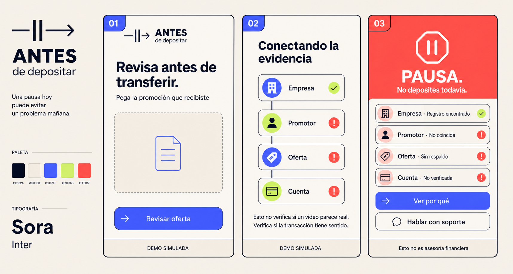
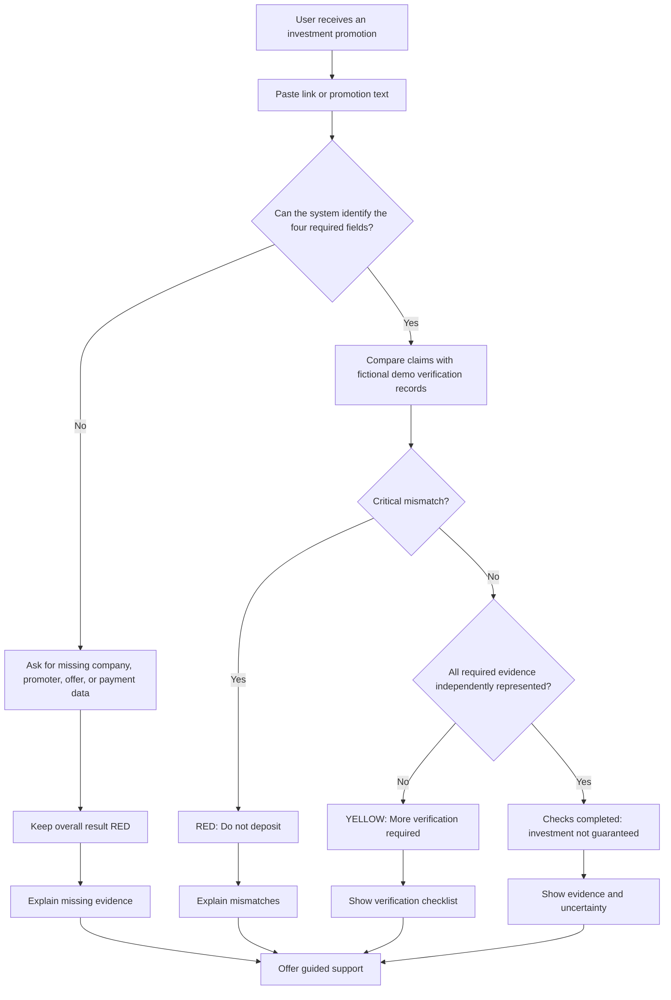
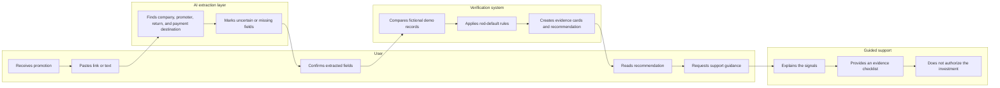

# ANTES DE DEPOSITAR

**Business Bending · Week 3 · Rodrigo Peña · Operator · Team 8**  
**Working slice:** pre-deposit verification for suspicious investment offers received through WhatsApp or Facebook.

> **Packet-before-code status:** Approved for implementation on August 26, 2026. The packet, generated mockup, scope cut, and test plan were completed before product code.

## 1. Problem in my words

In Mexico, a person can receive a convincing investment promotion through WhatsApp or Facebook, see a real company name, a confident promoter, professional-looking documents, or even a persuasive video, and believe that the opportunity has been verified. The dangerous moment is not after the fraud. It is the few minutes before the first deposit, when the user needs a simple way to slow down, identify missing evidence, and avoid sending money to an unrelated person or account.

This product does not try to decide whether a video is fake. It checks whether the **transaction chain** is coherent: company authorization, promoter relationship, offer evidence, and receiving account. One real-looking signal never makes the investment safe.

## 2. Exact user

**Primary persona:** a Mexican adult who received an investment offer through WhatsApp or Facebook, has limited digital and financial literacy, and is considering making a first transfer that same day.

**Concrete test persona:** Doña Elena, 61, sells food from home, uses WhatsApp every day and Facebook occasionally, reads slowly on her phone, trusts recommendations from known contacts, and is uncomfortable searching government registries. She wants to know one thing: **“Should I deposit now, or should I stop and ask for more proof?”**

## 3. Value proposition and business hypothesis

**User value:** turn a persuasive promotion into a short, evidence-based pause before money leaves the user's account.

**Business hypothesis:** the first pilot should be free to the person at risk. A consumer-protection organization, financial institution, insurer, or regulated platform could fund access because preventing one fraudulent transfer may cost less than fraud support, disputes, reimbursement, and lost trust. The payer and price are hypotheses to test; they are not proven in this week's slice.

## 4. Success definition

> **Before the Week 3 module closes, a deployed mobile-first prototype allows the target user to paste one suspicious investment promotion, confirm the company, promoter, promised return, and receiving account, and receive an evidence-specific recommendation in under three minutes. The product never calls the investment safe, keeps incomplete verification red, and offers a guided support handoff.**

### Prototype acceptance threshold

- The live URL completes the core flow without login or real personal data.
- The flow works on a phone-sized screen.
- The user can submit a link, pasted promotion text, or a fictional screenshot for visual extraction.
- The product extracts or requests the four transaction-chain fields.
- Each check shows the evidence used, what matched, and what remains unknown.
- Missing critical evidence produces a red result.
- A critical mismatch produces a red result and the explicit instruction **“Do not deposit.”**
- A coherent demo case may show individual positive checks, but the overall result never says **safe**, **approved**, or **guaranteed**.
- Simulated registry, AI, identity, or account outputs are visibly labeled **Demo simulation**.
- The user can open a guided support panel and see what evidence to request next.
- The user can correct extracted information and rerun the analysis.
- The user can download a local case summary without sending it to a server.

## 5. Working slice

### Core task

The user pastes a suspicious investment link or message, or uploads a fictional screenshot. The application extracts or requests:

1. company name;
2. promoter name or contact;
3. promised return and basic offer terms;
4. receiving account or payment destination.

The application then compares the submission with a small, fictional verification dataset created only for the prototype. It displays four evidence cards and one overall recommendation. The important technology is the verification flow and the connection of claims across the transaction, not a generic deepfake score.

The user can edit any extracted field before analysis and correct it afterward. The application can generate a downloadable local case summary containing the submitted evidence, time, four checks, and recommendation; the Week 3 build does not store that summary on a server.

### Result language

- **Red — Do not deposit.** We found a critical mismatch or could not complete a required verification.
- **Yellow — More verification is required.** We did not find a critical contradiction, but there is not enough independent evidence to continue.
- **Evidence checks completed — Investment not guaranteed.** The demo data contains no critical contradiction. This does not mean the investment is safe or profitable.

## 6. Image-generated mockup

**Mockup intent:** a three-screen Spanish mobile flow showing intake, transaction-chain analysis, and the high-risk result. The identity is built around a pause interrupting a forward transfer: **ANTES** is the brand, “de depositar” is the descriptor, and the connected four-node chain is the core product motif.

**Visual identity:** warm oat replaces institutional white; dark ink provides accessible contrast; cobalt marks actions; acid lime means matched evidence; coral is reserved for stop states. Bold editorial typography, outlined cards, and the custom pause/arrow symbol make the product feel like a contemporary consumer startup rather than a bank, government portal, or generic cybersecurity tool.

## 7. Feature flow

## 8. Actor swimlane

## 9. Global benchmark → Mexican localization

**Best existing benchmark:** [FINRA BrokerCheck](https://www.finra.org/investors/investing/working-with-investment-professional/about-brokercheck) makes official registration and professional history searchable; the [UK FCA Firm Checker](https://www.fca.org.uk/consumers/how-check-firm-individual-authorised) tests whether a firm is authorized for the service it claims to offer; and [Singapore ScamShield](https://www.scamshield.gov.sg/about-scamshield/scamshield-app/) makes suspicious-message checking and reporting easy.

**How this slice differs or localizes:** Antes de Depositar brings the check into the WhatsApp/Facebook decision moment, uses plain Spanish, treats company, promoter, offer, and payment destination as one connected chain, and keeps incomplete verification visibly red for a user who may not know which Mexican registry to search.

## 10. Three-year long view

In three years, Antes de Depositar could become a free, WhatsApp-first verification and support rail used before risky consumer payments in Mexico. It could connect the appropriate regulator by investment type, participating financial institutions, verified promoters, and consented reports while keeping the decision evidence-specific and appealable. Its defensible value would not be a deepfake detector; it would be the trusted operating network that connects a suspicious claim to an identity, authorization, document trail, payment destination, and timely human response.

## 11. Scope cut — what this build will not do

- No generic deepfake, face, or voice detector.
- No real INE, biometric, liveness, or identity verification.
- No connection to real bank-account ownership data.
- No claim that a company, promoter, or investment is safe.
- No real-time integration with WhatsApp or Facebook; the user pastes content.
- No real human adviser or five-minute service-level promise; the prototype demonstrates the handoff.
- No transmission to an authority.
- No storage or processing of real personal data; screenshots and examples must be fictional.
- No nationwide registry coverage; all demo verification records are fictional and labeled.
- No investment recommendation, expected-return calculation, or financial advice.

## 12. Blueprint conditions translated into product requirements

| Blueprint condition | Product requirement in this slice |
|---|---|
| Incomplete transaction-chain verification stays red | Missing company, promoter, offer, or payment evidence forces the overall red state |
| Never present an investment as safe | Forbidden words are excluded from all recommendations; every status includes uncertainty |
| Simple share → compare → result → support flow | One mobile flow with paste, confirmation, evidence cards, recommendation, and guided support |
| Affordable and distributable | Free web prototype, no premium device, no complex onboarding, no long form |
| Privacy and appeal | Fictional data only; correction and reanalysis controls; local evidence-summary download; no biometrics or authority sharing |
| User and Technologist validation gaps remain open | Persona test measures comprehension; mechanical test verifies rule behavior and labeling |

## 13. Architecture and stack

| Layer | Week 3 choice | Reason |
|---|---|---|
| Interface | Next.js + TypeScript, mobile-first CSS | Fast free deployment and testable components |
| Promotion analysis | Gemini 3.7 Flash through `@google/genai`, with structured JSON output; deterministic labeled demo fallback | Supports text and image extraction while keeping the live demo reliable |
| Verification logic | Transparent TypeScript rules | Every red/yellow result can name the exact evidence and rule |
| Demo records | Local fictional JSON fixtures | No personal data, no external dependency, reproducible tests |
| Support handoff | Guided in-app support panel | Demonstrates the operating moment without pretending a live adviser exists |
| Evidence record | Client-side case-summary download | Honors the Operator declaration without storing personal data |
| Testing | Unit tests for rules + browser-level core-flow checks | Covers both logic and user completion |
| Hosting | OpenAI Sites, public deployment | Matches the actual live environment and preserves a versioned deployment history |
| Repository | GitHub | Provides commit history and packet-before-code evidence |

### Security floor

- No secrets committed to the repository.
- `GEMINI_API_KEY` is server-side only and must be configured as a protected OpenAI Sites runtime value. When it is absent, the public prototype uses the visibly labeled deterministic demo path and never pretends that image extraction occurred.
- No real personal data in fixtures, screenshots, seeds, or demos.
- All form fields have type and length validation.
- Submitted text is treated as untrusted input and never executed as code or HTML.
- The prototype stores no personal data; if storage is later added, authentication and row-level security become mandatory.
- All simulated outputs are labeled on the result screen.
- The free API tier is used only with fictional course data because free-tier content may be used by the provider to improve its products.

Technical references: [Gemini image understanding](https://ai.google.dev/gemini-api/docs/image-understanding), [structured outputs](https://ai.google.dev/gemini-api/docs/structured-output), and [Developer API pricing](https://ai.google.dev/gemini-api/docs/pricing).

## 14. Test plan

### Mechanical pass

| Test | Input | Expected result |
|---|---|---|
| Missing payment destination | Promotion without account or payment instruction | Overall red; missing-evidence reason; no safe language |
| Company-name impersonation | Real-looking company name with mismatched promoter/contact in fictional fixtures | Overall red; exact mismatch displayed |
| Unrealistic guaranteed return | Promotion says guaranteed high return without supporting offer evidence | Overall red; unsupported guarantee displayed |
| Coherent fictional record | All four fictional records align | Evidence cards complete; investment-not-guaranteed warning remains visible |
| Empty or oversized input | Blank submission or text over the limit | Submission blocked with a plain-language validation message |
| Invalid screenshot | Unsupported format or file over 5 MB | Upload blocked; supported types and limit explained |
| Mobile completion | Full core flow at phone viewport | No horizontal scrolling; main action and warning remain visible |
| Simulation disclosure | Any analyzed demo case | “Demo simulation” visible before and after analysis |
| Correction path | User edits an extracted company or account | Analysis reruns and the visible evidence reasons update |
| Evidence record | User downloads the case summary | File contains the fictional input, timestamp, checks, and warning; no server write occurs |
| API failure | Gemini is unavailable or the key is absent | User receives an honest fallback notice and can use a labeled demo case or manual entry |

At least one bug discovered during this pass must be logged, fixed, committed, and redeployed before submission.

### Persona test

Create a fresh conversation with this persona:

> You are Doña Elena, 61, sells food from home, uses WhatsApp every day, reads slowly on her phone, distrusts unfamiliar apps, and quietly gives up when a screen asks for technical information. You received an investment promotion from a known contact and are considering depositing today. Attempt the task as her. Narrate every hesitation, confusing word, trust concern, and point where you would quit.

Walk the persona through screenshots of each screen in order. Record every confusion, rank the problems, fix the worst one, retest it, commit the change, and redeploy.

## 15. Operator plan for the first 100 users

- Automation organizes the submission and explains missing evidence before support begins.
- Red cases with a concrete mismatch receive the highest support priority.
- Incomplete cases receive a checklist and can be resubmitted without blocking the queue.
- Human support, in the full product, explains signals but never authorizes an investment.
- The first operational bottlenecks are the quality of registry matching, ambiguous promoter relationships, and the support queue.

## 16. Decision log and open hypotheses

### Decisions already made

- The primary vacuum remains **Proof-of-Human for commerce**, narrowed to false investment offers before the first deposit.
- The product checks the transaction chain instead of judging whether media looks real.
- Incomplete verification stays red.
- The Week 3 live build uses fictional data and clearly labeled simulation.
- The target user does not pay during the pilot hypothesis.
- Gemini 3.7 Flash is the selected multimodal extraction API; a deterministic demo adapter is the reliability fallback.
- Evidence is preserved through a client-side downloadable summary, not a server database.

### Hypotheses to test, not facts

- A consumer-protection organization or financial institution will fund access.
- The user understands evidence cards better than a single risk score.
- A guided web flow can create enough friction to prevent an immediate deposit.
- Three minutes is short enough for the target user to complete the task.

### Remaining non-blocking implementation questions

- Whether the final demo should begin with pasted text or the fictional screenshot example.
- Whether the local case summary should download as Markdown or JSON; implementation may choose the simplest reliable format.

## 17. Commit and deployment plan

1. `docs: add approved packet before code`
2. `feat: add mobile promotion intake and validation`
3. `feat: add transparent verification rules and demo fixtures`
4. `feat: add evidence result and guided support flow`
5. `test: cover red-default rules and fix discovered bug`
6. `fix: apply persona-test improvement`

**Deployment 1:** functioning core flow after commits 1–4.
**Deployment 2:** branded public release with the mechanical extraction fix.
**Deployment 3:** persona-test clarification that makes simulated evidence prominent.

**Live product:** https://antes-de-depositar-w3.j6x567qt8g.chatgpt.site/
**Public repository:** https://github.com/rodrigobuilds3-creator/antes-de-depositar-w3
